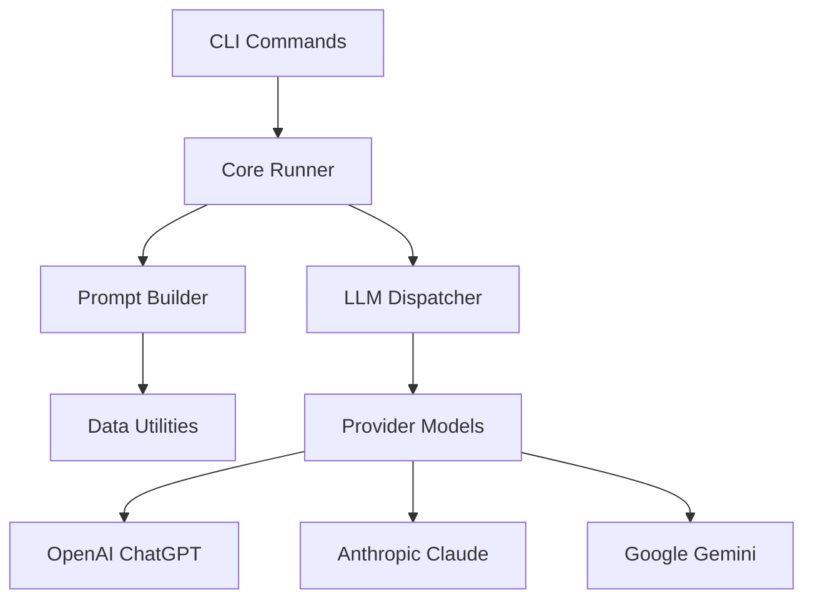

# LLM-MusicTheory Documentation

Comprehensive documentation for the LLM-MusicTheory research framework.

## Overview

LLM-MusicTheory is a research framework for studying how Large Language Models (LLMs) understand and analyze music theory concepts. The system supports multiple LLM providers, various music encoding formats, and provides both command-line and programmatic interfaces for conducting systematic studies.

## Documentation Structure

### 🚀 Getting Started
Perfect for new users who want to quickly get up and running.

- **[Musicologist's Guide](musicologist-guide.md)** - **START HERE** for music experts with no technical background
- **[Installation Guide](installation.md)** - Setup instructions and requirements
- **[Quick Start](quickstart.md)** - Your first music theory analysis in minutes
- **[Troubleshooting](troubleshooting.md)** - Common issues and solutions

### 📖 User Guide  
Detailed information for regular users and researchers.

- **[Configuration](configuration.md)** - Customize the system for your needs
- **[Adding Questions](adding-questions.md)** - Create your own music theory questions

### 🔬 Research
Resources for academic researchers conducting empirical studies.

- **[Research Guide](research.md)** - Academic research methodology and best practices

### 💻 API Reference
Complete programming interface documentation.

- **[API Documentation](api-reference.md)** - Full API reference with examples

### 📋 Examples
Practical examples for common use cases.

- **[Usage Examples](examples.md)** - Real-world usage scenarios

### 🛠️ Development
Information for contributors and developers.

- **[Development Guide](development.md)** - Contributing to the project

## Quick Navigation

### For Educators
- [Musicologist's Guide](musicologist-guide.md) → [Adding Questions](adding-questions.md) → [Examples](examples.md)

### For Researchers  
- [Installation](installation.md) → [Research Guide](research.md) → [Examples](examples.md)

### For Developers
- [Development Guide](development.md) → [API Reference](api-reference.md)

### For Integration
- [API Reference](api-reference.md) → [Examples](examples.md) → [Configuration](configuration.md)

## 🏗 Architecture

### System Overview

The LLM-MusicTheory toolkit follows a modular architecture with clean separation of concerns:



### Component Responsibilities

- **CLI Layer**: User interface and command parsing
- **Core Runner**: Orchestrates prompt execution workflow
- **Prompt Builder**: Assembles modular prompt components
- **LLM Dispatcher**: Routes requests to appropriate providers
- **Provider Models**: Abstract LLM provider implementations
- **Data Utilities**: File discovery and data loading

### Data Flow

1. CLI parses user input
2. Resources (prompts / encoded file / guides) are loaded
3. PromptBuilder assembles ordered sections
4. Dispatcher provides the selected model instance
5. Model queried; response returned
6. (Optional) Artifacts persisted (response & JSON input bundle)

## 📖 API Reference

### Core Classes

#### `PromptRunner`

Central orchestrator for one prompt execution.

Constructor (simplified):
```python
PromptRunner(
    model: LLMInterface,
    file_id: str | None = None,            # preferred identifier
    datatype: str = "mei",
    context: bool = False,
    dataset: str = "fux-counterpoint",    # new default dataset name
    base_dirs: dict[str, Path] | None = None,
    temperature: float = 0.0,              # validated to [0.0,1.0] at build
    max_tokens: int | None = None,
    save: bool = False,
    # Legacy aliases (still accepted by tests / scripts):
    question_number: str | None = None,
    exam_date: str | None = None,
)
```

Call `run()` to receive the raw model response. When `save=True` a sibling
`*.input.json` bundle capturing all assembled components is also written.

#### `LLMInterface`

Abstract base for all LLM providers.

```python
class LLMInterface(ABC):
    @abstractmethod
    def query(self, input: PromptInput) -> str:
        """Send prompt to LLM and return response."""
```

#### `PromptBuilder`

Assembles prompt sections into a `PromptInput`. Supports deterministic
ordering (legacy default vs. custom ordering for new datasets).

Key idea: you pass raw components → builder returns validated `PromptInput`.

### Utility Functions

#### Path Utilities

```python
def find_project_root(start_path: Optional[Path] = None) -> Path:
    """Find project root by locating pyproject.toml."""

def list_datatypes(encoded_dir: Path) -> List[str]:
    """Return available music formats."""

def list_questions(questions_dir: Path) -> List[str]:
    """Return available question IDs."""
```

### CLI Commands

#### `run-single`

Execute single prompt with specified parameters.

```bash
poetry run run-single [OPTIONS]
```

**Options:**
- `--model {chatgpt,claude,gemini}`: LLM provider (required) or specific model name (e.g., gpt-4o, claude-3-sonnet, gemini-2.5-pro)
- `--file-id TEXT` / `--question TEXT`: Identifier (legacy alias retained)
- `--datatype {mei,musicxml,abc,humdrum}`: Music format (required)
- `--context`: Include context guides
- `--temperature FLOAT`: Sampling temperature
- `--max-tokens INTEGER`: Response length limit
- `--no-save`: Don't save response to file (default: automatically save)

#### `run-batch`

Execute multiple prompts automatically.

```bash
poetry run run-batch [OPTIONS]
```

**Options:**
- `--models TEXT`: Comma-separated list of models (supports provider names like 'chatgpt,claude' or specific models like 'gpt-4o,claude-3-sonnet,gemini-2.5-pro')
- `--questions TEXT`: Comma-separated list of questions  
- `--datatypes TEXT`: Comma-separated list of formats
- `--context`: Include context guides
- `--temperature FLOAT`: Sampling temperature

## ⚡ Best Practices

### Prompt Design

1. Keep it minimal first; add guides/context only if needed
2. Context increases tokens (cost) – measure value before scaling up
3. Temperature 0.0 for reproducibility; >0.4 for exploratory / creative tasks
4. Constrain `max_tokens` to prevent runaway cost

### Development

1. **Test First**: Run tests before making changes
2. **Mock APIs**: Never test with real API calls
3. **Environment Isolation**: Use Poetry virtual environments
4. **Type Hints**: Add type annotations for better IDE support

### Cost Management

1. Start with lower‑cost providers while iterating
2. Leverage free tiers (Gemini) before using premium models
3. Monitor dashboards; set soft internal token budgets
4. Batch experiments; reuse compiled prompt bundles when possible

### File Organization

```
project/
├── outputs/
│   ├── ChatGPT/
│   │   ├── fux-counterpoint__Q1b_mei_context.txt
│   │   └── fux-counterpoint__Q1b_mei_context.input.json
│   └── Claude/
├── data/ (optional project‑specific dataset)
└── experiments/
```

## 🧩 Advanced Usage

### Custom LLM Providers

Create new provider by extending `LLMInterface`:

```python
from llm_music_theory.models.base import LLMInterface, PromptInput

class CustomProvider(LLMInterface):
    def __init__(self, api_key: str):
        self.api_key = api_key
    
    def query(self, input: PromptInput) -> str:
        # Implement your API integration
        response = your_api_call(
            system=input.system_prompt,
            user=input.user_prompt,
            temperature=input.temperature
        )
        return response.text
```

### Custom Prompt Components

Extend prompt building with custom components:

```python
from llm_music_theory.prompts.prompt_builder import PromptBuilder

class CustomPromptBuilder(PromptBuilder):
    def add_custom_section(self, content: str) -> str:
        return f"\n## Custom Section\n{content}\n"
```

### Batch Experiments

Programmatic batch processing:

```python
from llm_music_theory.core.runner import PromptRunner
from llm_music_theory.core.dispatcher import get_llm

models = ["chatgpt", "claude", "gemini"]
questions = ["Q1a", "Q1b", "Q2a"]
datatypes = ["mei", "musicxml"]

results = {}
for model_name in models:
    llm = get_llm(model_name)
    for question in questions:
        for datatype in datatypes:
            runner = PromptRunner(
                model=llm,
                question_number=question,
                datatype=datatype,
                context=True,
                save=True
            )
            response = runner.run()
            results[f"{model_name}_{question}_{datatype}"] = response
```

## 🚨 Troubleshooting

### Common Issues

**Q: Tests fail with "system prompt not found"**
A: This is expected for comprehensive tests when legacy data is incomplete. Core tests should pass.

**Q: ImportError for llm_music_theory module**
A: Ensure Poetry environment is active: `poetry shell` and `poetry install`

**Q: API key errors**
A: Check `.env` file format. No spaces around `=` sign.

**Q: High API costs**
A: Use Google's free tier. Set `max_tokens` limits.

### Debug Mode

Enable verbose logging:

```python
import logging
logging.basicConfig(level=logging.DEBUG)
```

### Performance Tips

- Use `temperature=0.0` for reproducible results
- Set appropriate `max_tokens` to control costs
- Cache responses when experimenting
- Use batch processing for multiple queries

---

For more information, see the main [README.md](../README.md) or the examples documentation.

## 📖 Documentation Standards

### Writing Guidelines

1. **Clear Structure**: Use consistent headings and organization
2. **Code Examples**: Include runnable code snippets
3. **Cross-References**: Link between related documentation
4. **Version Information**: Note when features were added/changed
5. **Accessibility**: Use clear language and good formatting

### Markdown Standards

```markdown
# Main Title (H1)
## Section (H2)
### Subsection (H3)

- Use bullet points for lists
- **Bold** for emphasis
- `code` for inline code
- ```language for code blocks
```

### Code Documentation Standards

```python
def example_function(param1: str, param2: int = 0) -> str:
    """
    Brief description of what the function does.
    
    Args:
        param1: Description of first parameter
        param2: Description of second parameter with default
    
    Returns:
        Description of return value
    
    Raises:
        ValueError: When parameter validation fails
        
    Example:
        >>> result = example_function("hello", 42)
        >>> print(result)
        "hello: 42"
    """
    return f"{param1}: {param2}"
```

## 🚀 Documentation Roadmap

### Completed ✅
- [x] Main README with comprehensive setup
- [x] Basic project structure documentation
- [x] Test coverage documentation

### In Progress 🔄
- [ ] API reference generation with Sphinx
- [ ] User guide tutorials
- [ ] Architecture diagrams

### Planned 📋
- [ ] Video tutorials for common workflows
- [ ] Interactive examples with Jupyter notebooks
- [ ] Troubleshooting guides for common issues
- [ ] Advanced usage patterns and best practices

## 📝 Contributing to Documentation

### Quick Fixes
For small documentation fixes:
1. Edit the relevant `.md` file directly
2. Submit a pull request with your changes

### Major Documentation Changes
For significant documentation work:
1. Create an issue to discuss the changes
2. Fork the repository
3. Create a documentation branch
4. Make your changes following our style guide
5. Test the documentation builds successfully
6. Submit a pull request

### Documentation Issues
If you find documentation that is:
- Unclear or confusing
- Missing important information
- Contains errors or outdated information

Please [open an issue](https://github.com/liampond/LLM-MusicTheory/issues) with the label `documentation`.

## 🎯 Documentation Goals

1. **Accessibility**: Make the project approachable for new users
2. **Completeness**: Cover all features and use cases
3. **Accuracy**: Keep documentation in sync with code changes
4. **Discoverability**: Make it easy to find relevant information
5. **Maintainability**: Structure docs for easy updates

---

*Documentation last updated: August 2025*
